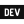

# About me

Hi, I am Sean van Zuidam also known on the web as [@GrimLink](https://twitter.com/GrimLink).

I am a Frontend Developer from Zwolle, The Netherlands.

Gamer, Anime watcher and fan of METAL, Rock and Chiptune music 🤘

I am also the creator of [@fylgja](https://github.com/fylgja).
The modular highly customizable CSS framework. Powered by CSS Components for building your Web UI.

**Find me also on:**

<a rel="me" href="https://twitter.com/grimlink">
  <picture>
    <source media="(prefers-color-scheme: dark)" srcset="./assets/socials/dark/twitter.svg">
    
  </picture>
</a>

<a rel="me" href="https://www.linkedin.com/in/seanvanzuidam">
  <picture>
    <source media="(prefers-color-scheme: dark)" srcset="./assets/socials/dark/linkedin.svg">
    
  </picture>
</a>

<a rel="me" href="https://mastodon.social/@GrimLink">
  <picture>
    <source media="(prefers-color-scheme: dark)" srcset="./assets/socials/dark/mastodon.svg">
    
  </picture>
</a>

<a rel="me" href="https://instagram.com/seangrimlink">
  <picture>
    <source media="(prefers-color-scheme: dark)" srcset="./assets/socials/dark/instagram.svg">
    
  </picture>
</a>

<a rel="me" href="https://dev.to/grimlink">
  <picture>
    <source media="(prefers-color-scheme: dark)" srcset="./assets/socials/dark/devto.svg">
    
  </picture>
</a>

<a rel="me" href="https://www.youtube.com/@SeanGrimLink">
  <picture>
    <source media="(prefers-color-scheme: dark)" srcset="./assets/socials/dark/youtube.svg">
    
  </picture>
</a>

<a rel="me" href="https://www.reddit.com/user/GrimLink">
  <picture>
    <source media="(prefers-color-scheme: dark)" srcset="./assets/socials/dark/reddit.svg">
    
  </picture>
</a>

<a rel="me" href="https://about.me/grimlink">
  <picture>
    <source media="(prefers-color-scheme: dark)" srcset="./assets/socials/dark/aboutme.svg">
    
  </picture>
</a>